# SmartReview（施工方案审核系统）

## 简介

SmartReview 面向施工方案的全流程管理与智能审核。系统支持账号与角色、方案类型与编制依据维护、按方案类型绑定 Word 模板（对象存储中的文件与标题树 JSON）、方案审核任务与报表，以及管理仪表盘与系统设置（知识库、审核策略、大模型、OnlyOffice 等）。

后端基于 FastAPI，并与独立 Worker 进程协同处理待办审核队列；可选对接自建 Dify 与火山引擎、MiniMax 等 LLM。

**这个可以进一步扩展到像变更方案审核、合同审核等。**

## 核心能力

- **身份与权限**：登录、JWT、用户与角色管理。
- **主数据**：方案类型、编制依据（管理员 CRUD）；方案类型绑定的 Word 模板与 MinIO 存储、标题树结构。
- **审核任务**：创建与跟踪方案审核任务；**API 与独立 Worker**（`worker.py`、队列轮询）并行读写 MySQL / MinIO，Docker Compose 中对应 `worker` 服务。
- **在线编辑**：**OnlyOffice** 文档服务集成（JWT、回调 URL；可在环境变量或系统「设置 → OnlyOffice」中配置，详见 [.env.example](.env.example)）。
- **可选集成**：Dify 知识库 API（`DIFY_*`）、大模型提供方（如火山引擎、MiniMax、DeepSeek；环境变量与数据库设置并存，见 [.env.example](.env.example)）。
- **仪表盘**：统计与定时快照（API 启动时的 `dashboard_scheduler`）。

## 技术栈

| 层级 | 技术 |
| --- | --- |
| 前端 | React 19、Vite 8、TypeScript、Ant Design 6、TanStack Query、React Router |
| 后端 | Python 3.11+、FastAPI、SQLAlchemy、Alembic、MySQL、MinIO、JWT |
| 运行与编排 | Docker Compose：MySQL、MinIO、OnlyOffice Document Server、`smartreview-backend`、`smartreview-frontend`、Worker |

更细的本地安装、迁移与启动命令见 [backend/README.md](backend/README.md)。

## 架构

### 逻辑组件

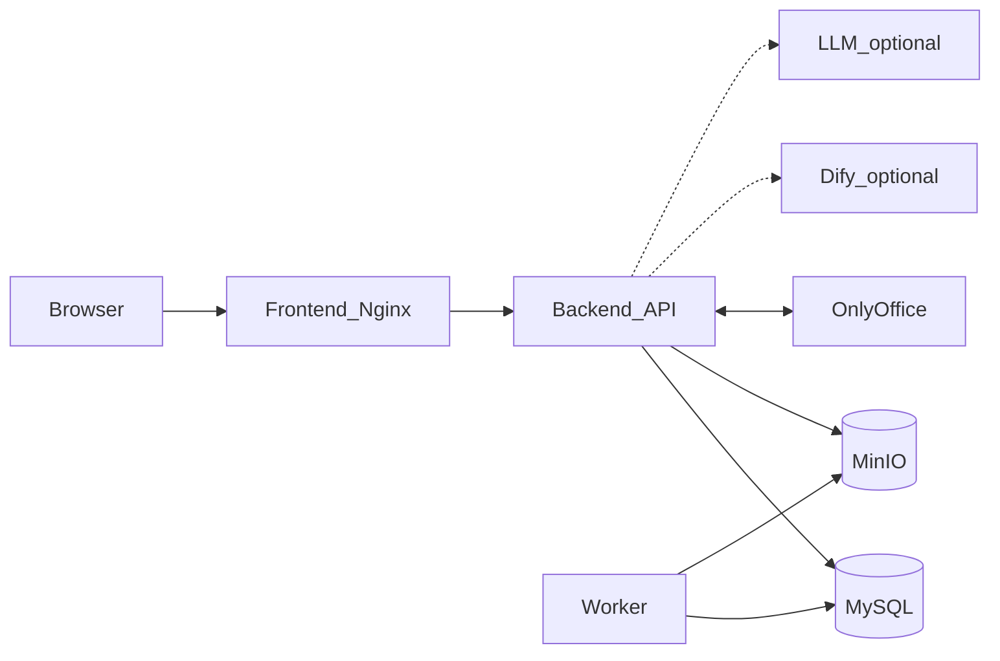

### Docker 部署视图（端口与依赖）

宿主机需配置 `HOST_IP`（浏览器可访问的本机地址，勿填 `127.0.0.1`，以便容器经宿主机访问 MinIO 等；见仓库根目录 Compose 文件头注释）。常见端口：前端 **80**，OnlyOffice **9080**，MinIO **9000**（S3 API）与 **9001**（控制台），MySQL **3306**；后端 API 在 Compose 网络内由前端反代访问，OnlyOffice 回调指向后端服务。

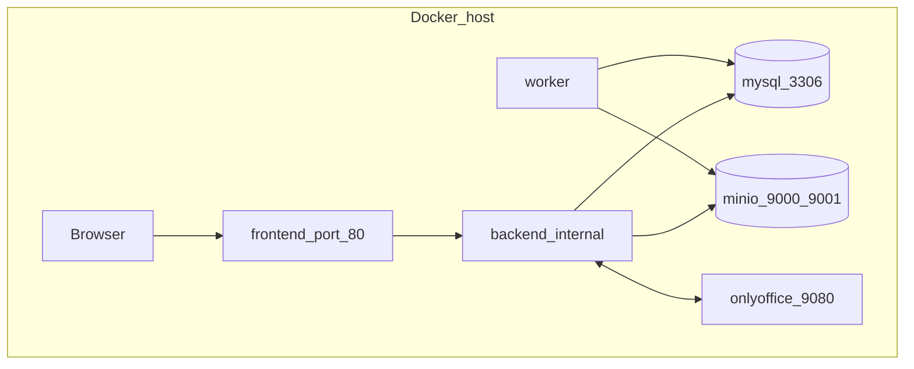

## 仓库结构

- `backend/` — FastAPI 应用、Alembic 迁移、`worker.py` 审核任务 Worker；说明见 [backend/README.md](backend/README.md)。
- `frontend/` — 管理端 SPA（Vite）。
- 根目录 **Docker Compose** 文件名为 `docker-compose .yml`（**文件名中含空格**），与 [.env.docker.example](.env.docker.example) 配套使用。

当前默认品牌图与浏览器 Tab 图标：`frontend/public/building.png`。

## 配置

将 [.env.example](.env.example) 复制为 `backend/.env`，按环境填写 MySQL、MinIO、`JWT_SECRET` 等。**勿将真实密码提交到 Git。** 本地开发请只用 `backend/.env`，不要用仓库根目录的 `.env`，以免与 Docker 环境变量混用。

**Docker Compose** 与本地分开：将 [.env.docker.example](.env.docker.example) 复制为仓库根目录 `.env.docker`。启动时需同时指定环境文件与 Compose 文件：使用 `docker compose`、参数 `--env-file .env.docker`、`-f` 指向 **`docker-compose .yml`**（含空格的文件名在 shell 中需加引号），再按需附加 `up -d --build` 等子命令。Compose 文件内注释说明了 `HOST_IP`、OnlyOffice JWT、各服务依赖关系。

前端开发默认通过 Vite 代理访问 API：请求发往 `/api`，由 `frontend/vite.config.ts` 转发到 `http://127.0.0.1:8000`。若需直连，可设置环境变量 `VITE_API_BASE_URL`（例如 `http://127.0.0.1:8000`）。

## 快速开始

1. 在 MySQL 中创建与 `backend/.env` 一致的数据库，在 `backend/` 执行数据库迁移（`alembic upgrade head`），具体命令见 [backend/README.md](backend/README.md)。
2. 启动 MinIO，并创建与配置一致的 bucket（或留空由上传接口自动创建）。
3. 在 `backend/` 用 `uvicorn` 启动 API；在 `frontend/` 执行 `npm install` 与 `npm run dev`。管理员可通过 `ADMIN_BOOTSTRAP` 首次创建，或使用 `backend/scripts/create_admin.py`，详见 [backend/README.md](backend/README.md)。
4. 浏览器访问开发服务器地址（默认 `http://localhost:5173`）。

## Dify 部署手册（Docker Compose）

若需自建并接入 Dify，请以官方文档为准：

- [Dify Docker Compose 快速开始（中文）](https://docs.dify.ai/zh/self-host/quick-start/docker-compose)

建议顺序：

1. 安装 Docker、Docker Compose、Git。
2. 按官方文档克隆 Dify 部署仓库并进入目录。
3. 将官方示例环境文件复制为 `.env` 并完成配置。
4. 使用官方推荐的 `docker compose up -d` 一类命令启动服务。
5. 浏览器打开 Dify Web 完成初始化。

本仓库**不包含** Dify 的 Compose 编排文件；接入时在 SmartReview 的「设置」或环境变量中填写 Dify 基址与 API Key（见 [.env.example](.env.example) 中 `DIFY_*`）。

## 需求说明

功能与模块划分见上文；数据库与对象存储连接信息仅通过环境变量与系统设置配置，本文档不列举口令。

## 系统说明

### 1. 数据分析

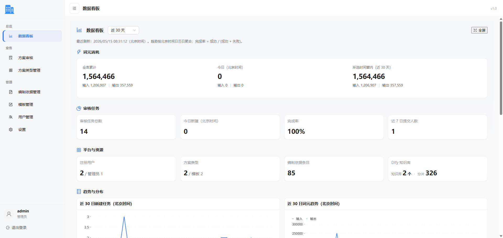

页面用于汇总系统运行概况，便于快速判断当前审核进度与资源消耗。

- **核心信息**：方案数量、审核任务状态、知识库信息、Token 消耗等。
- **使用价值**：帮助管理员快速识别任务积压、资源开销和重点跟进项。

### 2. 模板管理与规则设置

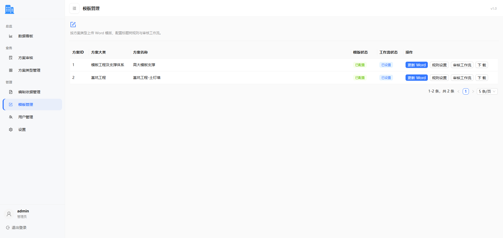

在模板管理中可维护方案模板。点击“更新 Word”后，系统会加载文档结构，再进入规则设置进行章节级配置。

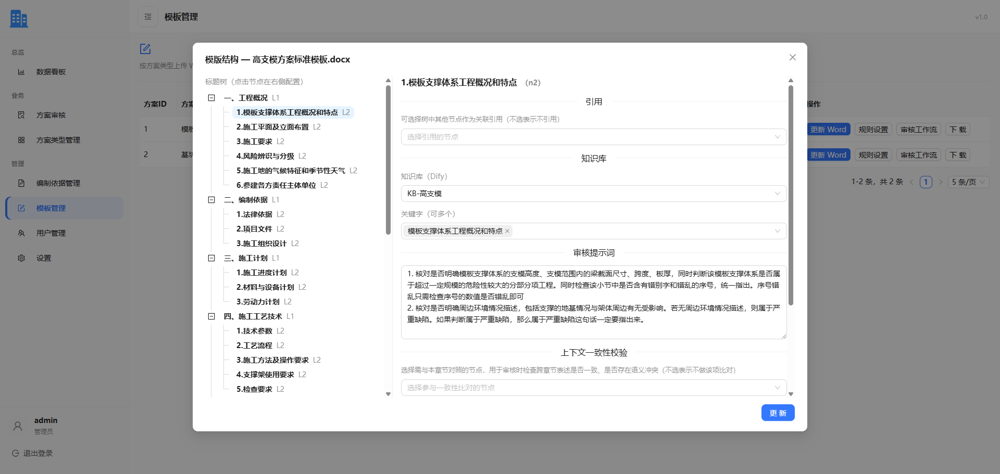

规则设置支持按章节节点配置审核上下文：

- **引用**：审核当前章节时，引用其他内部章节内容。
- **知识库**：绑定当前章节审核依赖的外部知识库。
- **审核提示词**：定义当前章节的审核指令与关注点。
- **上下文一致性校验**：检查当前章节与其他章节在语义、数据上的一致性。
- **编制依据**：校验章节内容是否符合系统预置编制依据。

规则配置越完整，审核结果通常越准确、越稳定。

随后可配置审核工作流，按需开启或关闭对应流程环节。

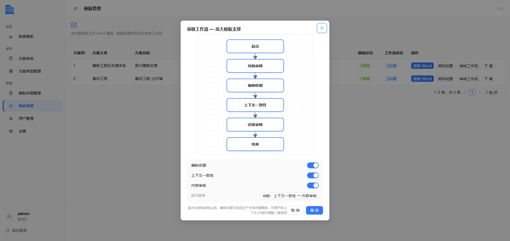

### 3. 系统设置

系统设置集中管理知识库、模型、审核策略和在线文档服务。

知识库配置（当前支持 Dify）：

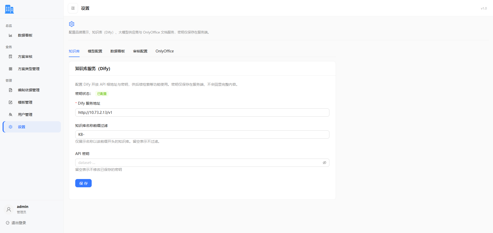

模型配置：

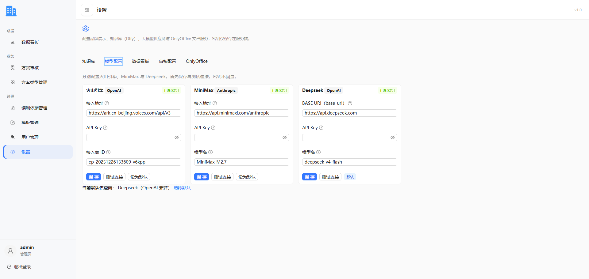

审核设置（并发控制、调试开关等）：

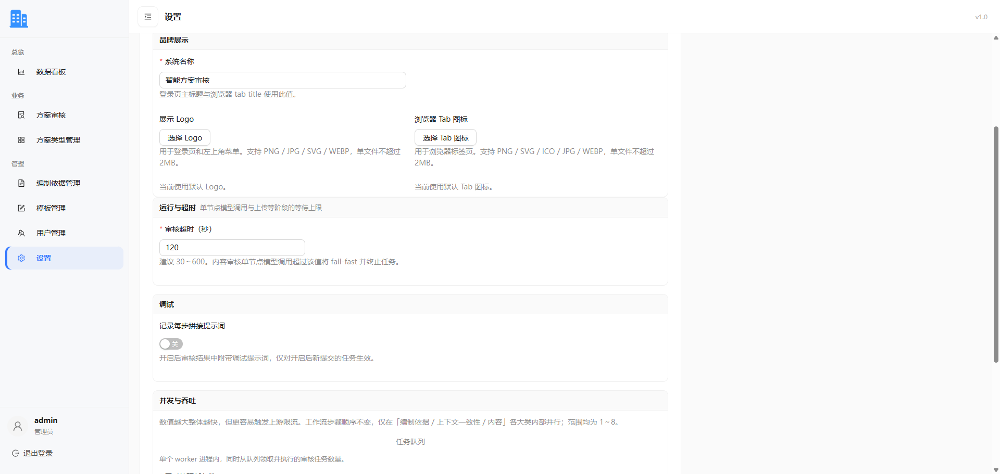

开启调试开关后，可在审核界面查看完整提示词，便于排查问题和优化规则。

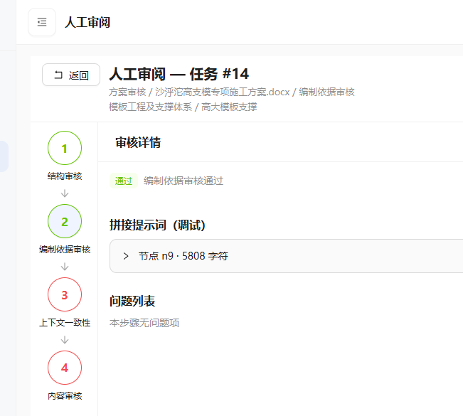

OnlyOffice 对接（在线预览、编辑与下载）：

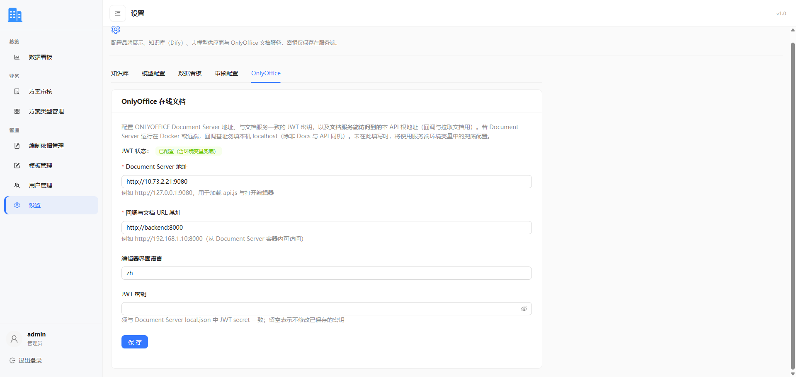

### 4. 方案审核与人工审阅

可先下载方案模板进行编写，再上传发起审核。系统会将审核批注写入 Word 文档。

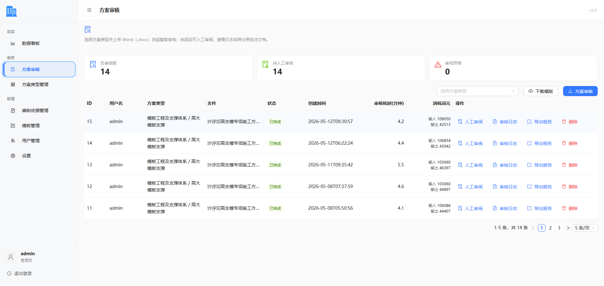

点击“人工审阅”可查看审核 Web 结果页面。

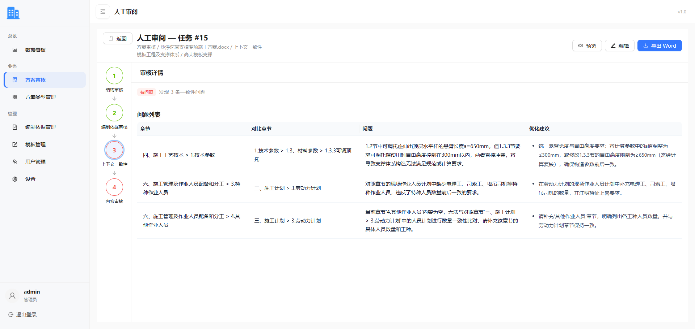

支持预览与编辑，调用 OnlyOffice 展示文档内容。

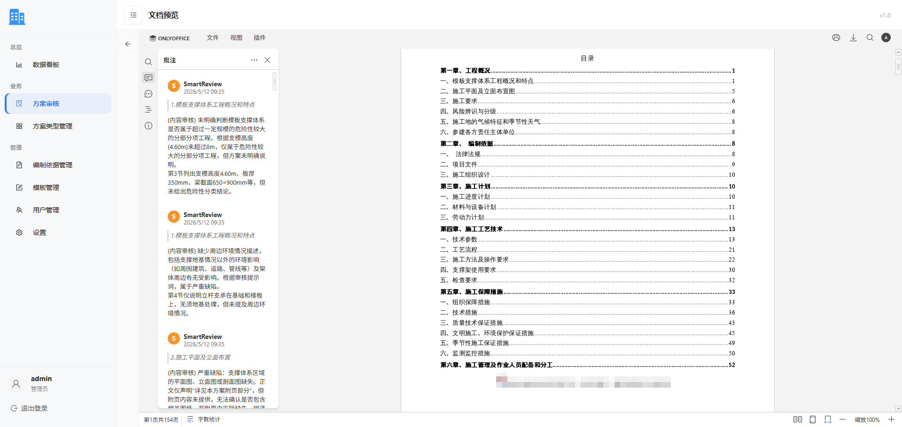

审核完成后可直接导出文档，并在其他 Office 软件中继续编辑。