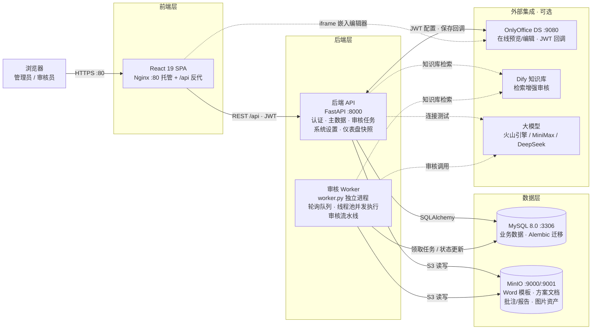
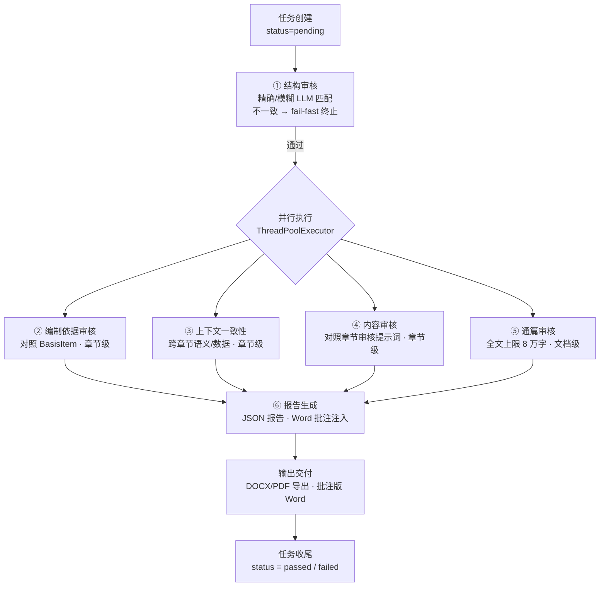
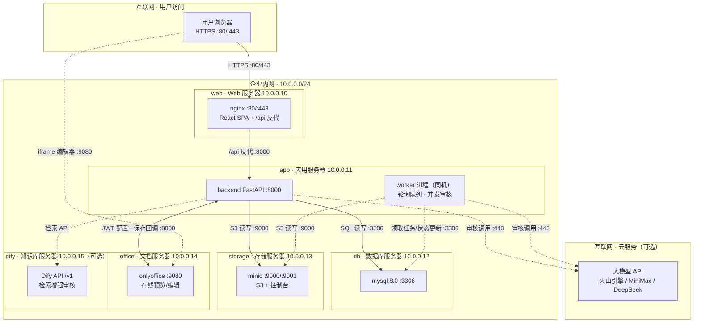

# SmartReview 系统架构（Mermaid 版）

> 可视化的 HTML/SVG 版本见 [`architecture-diagram.html`](architecture-diagram.html)（浏览器直接打开）。
> 以下为可直接嵌入文档 / README 的 Mermaid 源码。

## 1. 逻辑组件视图

## 2. 审核流水线视图（Worker 内部）

任务状态机：`pending → processing → passed | failed`；僵尸 `processing`（>5 分钟）自动回收；步骤顺序可配置
（`start → structure → [compilation_basis / context_consistency / content / full_document] → end`）。

## 3. Docker 部署视图（机器视角）

对外暴露：Web `:80/:443` · OnlyOffice `:9080` · MinIO 控制台 `:9001` · 其余服务仅内网互访。
启动：`docker compose --env-file .env.docker -f "docker-compose .yml" up -d --build`。

## 4. 后端模块清单（backend/app）

| 分层 | 模块 | 说明 |
| --- | --- | --- |
| 入口 | `main.py` | FastAPI 应用、CORS、启动管理员引导与仪表盘快照调度器 |
| 入口 | `worker.py` / `services/review_task_worker.py` | 独立 Worker：轮询 pending 队列（SKIP LOCKED 领取）、线程池并发执行 |
| API 路由 | `api/` | auth · users · scheme_types · basis · templates · review_tasks · settings_kb（Dify）· settings_model · settings_review · settings_upload · settings_onlyoffice · settings_dashboard · admin_dashboard · onlyoffice_callback |
| 核心 | `core/security.py` `config.py` `database.py` | JWT 与密码哈希、配置、SQLAlchemy 会话 |
| 模型 | `models/` | user · scheme_type · basis_item · scheme_template · scheme_review_task · 各运行时/系统设置表 · dashboard 快照 |
| 审核 | `services/review_pipeline.py` | 审核流水线：结构匹配 → 编制依据 / 上下文一致性 / 内容 / 通篇 → 报告生成 |
| 审核 | `services/review_report_*.py` | 报告内容组装、DOCX / PDF 导出 |
| 文档 | `services/word_parser.py` `doc_tree_utils.py` `tree_align.py` `structure_llm_matcher.py` `title_normalize.py` | DOCX 解析为标题树、模板-用户树对齐（精确/模糊）、LLM 结构匹配、标题规范化 |
| 文档 | `services/docx_comments.py` `docx_image_assets.py` | Word 批注注入、文档图片提取存储 |
| 存储 | `services/minio_storage.py` | MinIO S3 读写 |
| LLM | `services/llm/` | client · registry · resolve · chat；适配器：anthropic（MiniMax）、openai_compatible（火山引擎 / DeepSeek） |
| 集成 | `services/dify_client.py` `dify_settings.py` | Dify 知识库检索 |
| 集成 | `services/onlyoffice.py` `onlyoffice_settings.py` | OnlyOffice 编辑器配置（JWT）与回调 |
| 仪表盘 | `services/dashboard_*.py` | 统计、快照、定时调度 |

## 5. 前端页面路由（frontend/src）

| 路由 | 页面 | 权限 |
| --- | --- | --- |
| `/login` | 登录 | 公开 |
| `/dashboard` | 仪表盘（数据分析） | 管理员 |
| `/schemes` | 方案类型 | 管理员 |
| `/templates` | 模板管理（Word 模板 + 规则设置 + 工作流开关） | 管理员 |
| `/basis` | 编制依据 | 管理员 |
| `/review` | 方案审核 | 登录用户 |
| `/review/:taskId/manual` | 人工审阅（Web 结果 + OnlyOffice 预览） | 登录用户 |
| `/settings` | 系统设置（知识库 / 模型 / 审核策略 / OnlyOffice / 上传） | 管理员 |
| `/users` | 用户管理 | 管理员 |
| `/help` `/admin-manual` | 帮助与使用手册 | 登录 / 管理员 |
